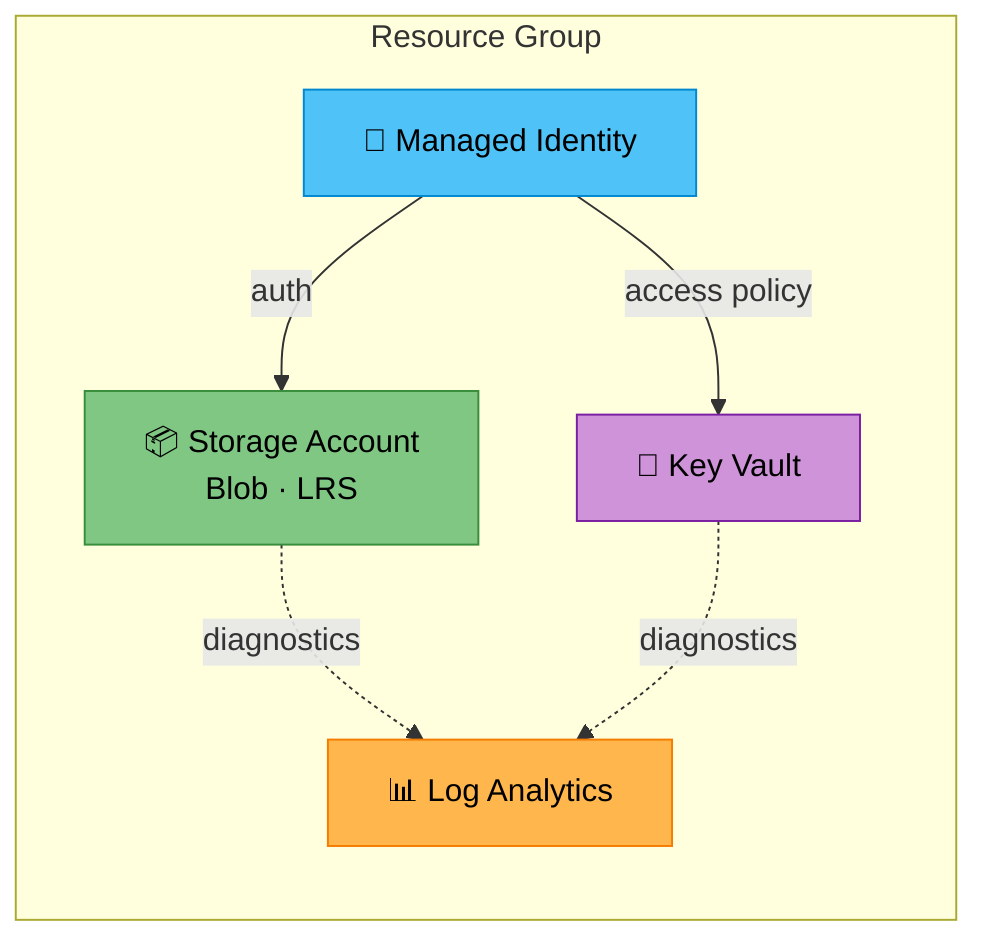
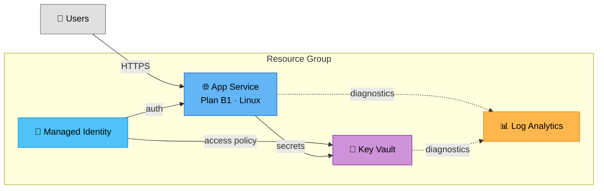
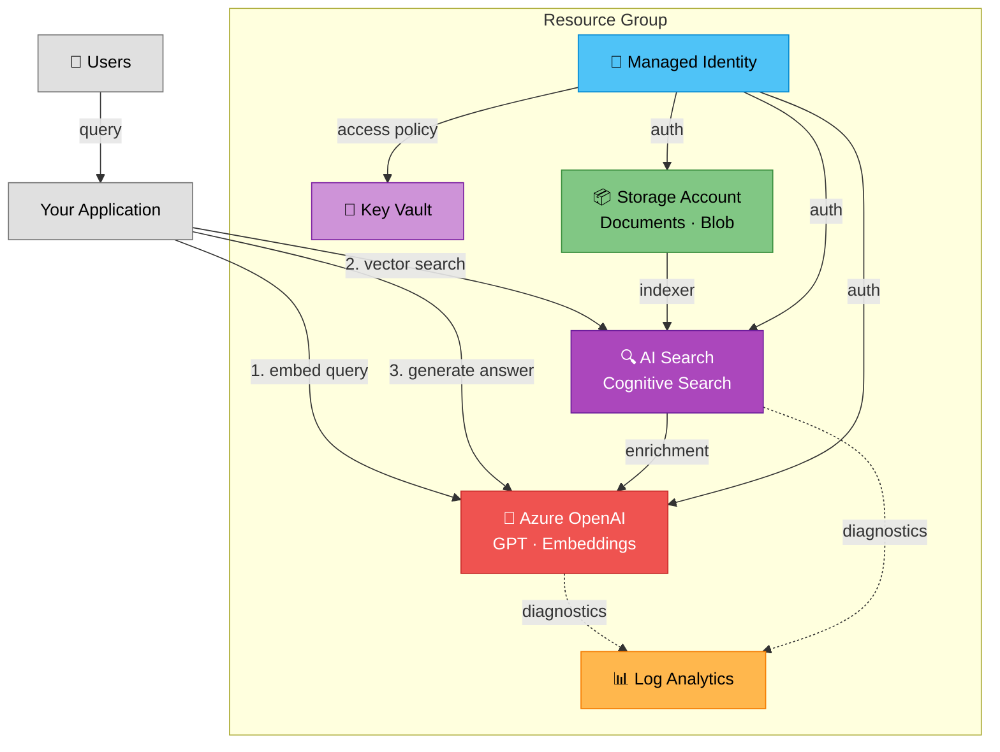
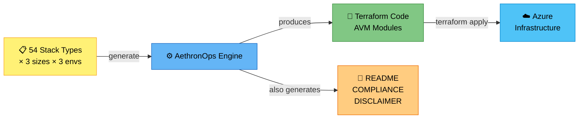

# AethronOps — Free Azure Infrastructure Examples

Production-ready Terraform stacks built with **Azure Verified Modules (AVM)** — Microsoft's official, maintained Terraform modules.

Each example is a complete, deployable infrastructure stack with:
- CAF naming conventions
- Managed Identity (zero secrets)
- Key Vault for secret management
- Log Analytics monitoring
- Compliance documentation (CAF, MCSB, RGPD, NIS2)

## Examples

| Stack | Description | Azure Services | Est. Cost |
|-------|-------------|----------------|-----------|
| [storage-baseline-mini](./storage-baseline-mini/) | Secure blob storage with versioning and soft-delete | Storage Account, Key Vault, Log Analytics | ~5€/month |
| [appservice-web-mini](./appservice-web-mini/) | Web application on App Service | App Service (B1), Key Vault, Log Analytics | ~15€/month |
| [rag-baseline-mini](./rag-baseline-mini/) | RAG AI pipeline with OpenAI + Search | Azure OpenAI, AI Search, Storage, Key Vault | ~30€/month |

> Cost estimates are for **dev/basic** tier in West Europe. Production tiers are higher.

## Architecture Diagrams

### storage-baseline-mini



### appservice-web-mini



### rag-baseline-mini — RAG AI Pipeline



### AethronOps — How It Works



## Quick Start

```bash
# 1. Pick a stack
cd storage-baseline-mini

# 2. Configure your environment
cp environments/dev.tfvars my.tfvars
# Edit my.tfvars — set project_name and subscription_id

# 3. Deploy
terraform init
terraform plan -var-file=my.tfvars
terraform apply -var-file=my.tfvars
```

## What is AethronOps?

AethronOps generates production-ready Azure infrastructure as code. These free examples showcase a fraction of the **54 stack types** available, each in 3 sizes (mini, medium, full) and 3 environments (dev, uat, prod).

Full catalog includes:
- **Landing Zones** — Hub-Spoke networking, governance
- **Web & API** — App Service, Functions, Container Apps, API Management
- **AI & ML** — RAG pipelines, ML workspaces, Cognitive Services
- **Data** — SQL, Cosmos DB, Data Factory, Databricks
- **Containers** — AKS, Container Apps, Container Registry
- **Infrastructure** — VMs, VMSS, Load Balancers, Static Sites

### Why AVM?

Azure Verified Modules are:
- Maintained by **Microsoft** (not community)
- Tested and validated against Azure best practices
- Updated with every Azure API change
- The **recommended** way to write Terraform for Azure

## Stack Structure

Every AethronOps stack follows the same structure:

```
stack-name/
├── main.tf              # Providers, locals, random resources
├── variables.tf         # Input variables with validation
├── outputs.tf           # Stack outputs
├── resource_group.tf    # Resource group module
├── identity.tf          # Managed Identity
├── keyvault.tf          # Key Vault for secrets
├── monitoring.tf        # Log Analytics workspace
├── *.tf                 # Service-specific resources
├── environments/
│   └── dev.tfvars       # Environment configuration
├── backend.tf.example   # Remote state template
├── README.md            # Quick start guide
├── COMPLIANCE.md        # Security & compliance matrix
├── DISCLAIMER.md        # Legal disclaimer
├── SOURCES.md           # AVM module versions & links
└── manifest.yaml        # Stack metadata
```

## Security & Compliance

All stacks implement:
- **MCSB** — Microsoft Cloud Security Benchmark controls
- **CAF** — Cloud Adoption Framework naming & structure
- **RGPD/GDPR** — Data protection by design (Art. 25, 32)
- **NIS2** — Network and information security measures

> These are technical controls, not certifications. See DISCLAIMER.md in each stack.

## License

These examples are provided under the [MIT License](./LICENSE). See DISCLAIMER.md in each stack for important legal information.

---

Built with [AethronOps](https://github.com/Aethron-ai/aethronops) — Azure infrastructure, done right.
