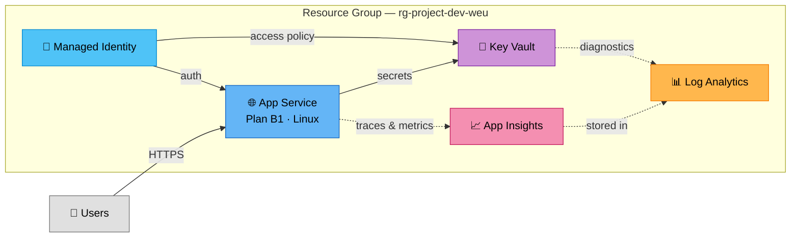

# appservice-web — Mini

> Generated by [AethronOps](https://aethronops.com) — Azure infrastructure with verifiable compliance proof.

## Architecture

| Property | Value |
|----------|-------|
| Pattern | appservice-web |
| Size | mini |
| Tier | basic |
| Bricks | 7 Azure Verified Modules |
| Compliance | CAF + WAF + MCSB + RGPD + NIS2 |

## Architecture Diagram



## Components — What Each Resource Does and How It's Secured

| Resource | Purpose | Security |
|----------|---------|----------|
| **Resource Group** | Logical container for all resources — enables unified RBAC, tagging, billing, and lifecycle management. | CAF naming convention, tag inheritance, RBAC scoping |
| **Log Analytics** | Central logging and monitoring — all services send diagnostic logs here. | 30-day retention, query-based alerts, SIEM-ready export (MCSB LT-1/LT-5) |
| **Managed Identity** | Passwordless authentication for all services — no credentials to manage or rotate. | User-assigned identity, RBAC least-privilege, no shared keys (MCSB IM-1) |
| **Key Vault** | Centralized secrets, keys, and certificates management. | RBAC authorization, soft-delete enabled, purge protection, network ACLs (MCSB DP-1/DP-3) |
| **App Service Plan** | Compute tier for App Service — defines CPU/RAM/scaling. | SKU adapted per environment (B1 dev, S1 uat, P1v3 prod) |
| **App Service** | Managed web application hosting — auto-scaling, deployment slots. | HTTPS only, managed identity, VNet integration in premium (MCSB NS-3) |
| **Application Insights** | Application performance monitoring (APM) — traces, metrics, exceptions. | Connected to Log Analytics, sampling configurable, IP anonymization |

## Quick Start

### 1. Prerequisites

- [Terraform](https://developer.hashicorp.com/terraform/install) >= 1.9
- An Azure subscription with Owner or Contributor role
- Azure CLI authenticated: `az login`

### 2. Configure Your Environment

Edit the tfvars file for your target environment:

```bash
# Edit environments/dev.tfvars (or uat.tfvars / prod.tfvars)
# Change these values:
#   project_name    = "your-project-name"
#   subscription_id = "your-azure-subscription-id"
```


### 3. Deploy

```bash
# Initialize Terraform (downloads AVM modules)
terraform init

# Preview what will be created
terraform plan -var-file=environments/dev.tfvars

# Deploy
terraform apply -var-file=environments/dev.tfvars
```

### 4. Multi-Environment Deployment

```bash
# Dev  (tier: basic  — minimal cost, no private endpoints)
terraform plan -var-file=environments/dev.tfvars

# UAT  (tier: standard — private endpoints, standard SKUs)
terraform plan -var-file=environments/uat.tfvars

# Prod (tier: basic — full security, HA, backups)
terraform plan -var-file=environments/prod.tfvars
```

### 5. Remote State (recommended for teams)

Copy `backend.tf.example` to `backend.tf` and configure your state storage:

```bash
cp backend.tf.example backend.tf
# Edit backend.tf with your storage account details
terraform init -migrate-state
```

## Enterprise Customization

This stack is designed to be extended with your organization's policies:

- **Custom tags**: Add mandatory tags in `custom_tags` variable (cost center, business unit...)
- **Network policies**: Set `require_private_endpoints = true` for zero-trust networking
- **Custom Checkov policies**: Add your rules in `.checkov.yaml` or `custom_checks/` directory
- **Azure Policy**: Add assignments in a `custom_policies.tf` file (not overwritten by AethronOps)

See `COMPLIANCE.md` for the full compliance matrix with space for your enterprise requirements.

## Integrating into an Existing Project

### This stack uses Azure Verified Modules (AVM)

All resources are deployed via [AVM modules](https://aka.ms/avm), officially maintained by Microsoft.
If your existing project uses raw `azurerm` resources, you have two options:

**Option A — Use this stack as-is** (recommended)
Deploy this stack as a separate Terraform workspace. It creates its own Resource Group, VNet,
and supporting services. Your existing infrastructure is not affected.

**Option B — Cherry-pick specific files**
Each `.tf` file is independent. Copy the files you need into your project and adapt the references:
- Replace `module.resource_group.name` with your own resource group name
- Replace `module.key_vault.resource_id` with your own Key Vault ID
- Replace `module.log_analytics.resource.id` with your own Log Analytics workspace ID

> **Note**: If you rewrite AVM modules as native `azurerm` resources, you are responsible
> for implementing the equivalent security configuration. AethronOps validates only the
> AVM-based code provided in this stack. See `SOURCES.md` for the exact modules used.

### Using Existing Infrastructure (Brownfield)

If you already have a VNet, Key Vault, or Log Analytics workspace, reference them
instead of creating new ones. Replace the module block with a data source:

```hcl
# Example: use an existing VNet (in networking.tf)
data "azurerm_virtual_network" "existing" {
  name                = "vnet-enterprise-prod-weu"
  resource_group_name = "rg-network-prod-weu"
}
# Then reference: data.azurerm_virtual_network.existing.id
```

Common brownfield replacements:
- `module "virtual_network"` → `data "azurerm_virtual_network"`
- `module "key_vault"` → `data "azurerm_key_vault"`
- `module "log_analytics"` → `data "azurerm_log_analytics_workspace"`
- `module "resource_group"` → `data "azurerm_resource_group"`

Each `.tf` file is independent — modify only the one you need without touching the others.

## File Structure

| File | Purpose |
|------|---------|
| `main.tf` | Terraform config, providers, locals |
| `resource_group.tf` | Resource group (CAF naming) |
| `*.tf` (domain files) | One file per functional domain |
| `variables.tf` | Input variables with validation |
| `outputs.tf` | Useful outputs (IDs, endpoints) |
| `environments/` | Per-environment tfvars |
| `COMPLIANCE.md` | Compliance proof matrix |
| `SOURCES.md` | AVM module sources and versions |
| `.checkov.yaml` | Security scan configuration |

## Security

All modules are [Azure Verified Modules](https://aka.ms/avm) — officially maintained by Microsoft.
Compliance references (CAF, MCSB, RGPD, NIS2) are documented in each `.tf` file header.

See `COMPLIANCE.md` for the detailed compliance matrix.

---
*Generated by AethronOps v2 — 7 bricks, basic tier*
